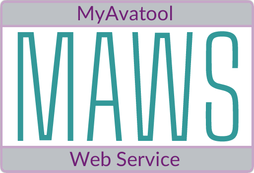

<!-- 220328.094653 -->

<h6 align="center">

  
  
</h6>

***

<h2 align="center">

  
   
  A custom web service for Netsmart's myAvatar™ EHR
   

</h2>

<h3 align="center">

  &nbsp;
  &nbsp;
  &nbsp;
  &nbsp;
  &nbsp;

</h3>

***

<h3 align="center">

  [Manual](doc/man/manual.md)&nbsp;&bull;&nbsp;[Changelog](doc/changelog.md)&nbsp;&bull;&nbsp;[Roadmap](doc/roadmap.md)&nbsp;&bull;&nbsp;[Known issues](doc/known-issues.md)

</h3>

***

#### CONTENTS
[About](#about) 
[Features](#features) 
[Requirements](#requirements) 
[Getting started](#getting-started) 
[Development](#development) 
[Additional information](#additional-information) 

# About
[Netsmart's myAvatar™](https://www.ntst.com/Solutions-and-Services/Offerings/myAvatar) is a behavioral health EHR that offers a recovery-focused suite of solutions that leverage real-time analytics and clinical decision support to drive value-based care.

While myAvatar™ is a robust platform, like most things in life (except [Heroes of Might and Magic III](https://www.gog.com/game/heroes_of_might_and_magic_3_complete_edition)), it isn't perfect.

The good news is that myAvatar™ functionality can be extended via Netsmart's myAvatar™ Web Services, and/or custom web services that are written by myAvatar™ users.

The **M**y**A**vatool **W**eb **S**ervice (**MAWS**) is one such custom web service which includes various tools and utilities for myAvatar™ that aren't included in the official release, and provides a solid foundation for building additional functionality quickly and efficiently.

# Features
* Several built-in tools and utilities for use with myAvatar™
* Does not require Java to be installed
* A solid foundation to build additional myAvatar™ custom tools and utilities

# Requirements
* A location to host the Avatool Web Service which meets the following requirements:
  * .NET Framework 4.8+ installed
  * Access to your myAvatar™ environments from the Avatool Web Service via HTTPS

# Getting started
The [MAWS Manual](doc/man/manual.md) contains everything you need to know about MAWS, and is updated with each release.

# Development
MAWS is developed by [A Pretty Cool Program](https://github.com/APrettyCoolProgram) and these [contributors](src/Resources/Doc/contributors.md), using these [third-party resources](src/Resources/Doc/built-with.md).

To contribute to the development branch of MAWS, please see our [contributing guidelines](src/Resources/Doc/contributing.md).

# Additional information
* [Acknowledgements](src/Resources/Doc/acknowledgements.md)
* [Related projects](src/Resources/Doc/related-projects.md)
* [Additional reading](src/Resources/Doc/additional-reading.md)

***

<!-- DEVELOPMENT FOOTER -->

<h3 align="center">

  

</h3>
