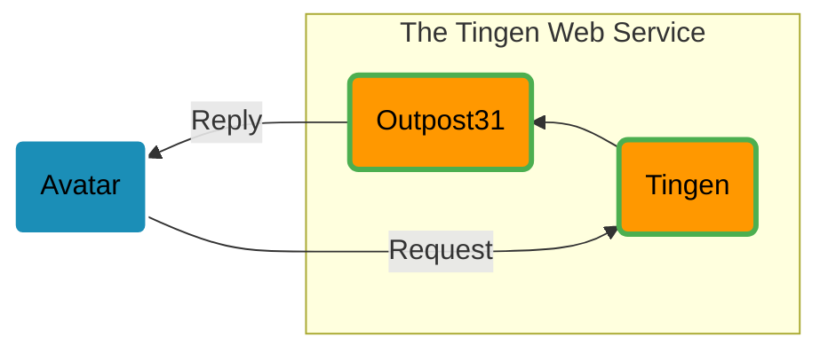

<!-- u250611 -->

  

  &nbsp;&nbsp;
  

# The Tingen Web Service

[Netsmart's Avatar™](https://www.ntst.com/Solutions-and-Services/Offerings/myAvatar) is a behavioral health EHR that offers a recovery-focused suite of solutions that leverage real-time analytics and clinical decision support to drive value-based care.

While Avatar™ is a robust platform, it isn't perfect. The good news is that you can extend myAvatar™ functionality via Netsmart's Avatar™ Web Services, and/or custom web services that are written by other Avatar™ users.

**Tingen** is one such custom web service which includes various tools and utilities for Avatar™ that aren't included in the official release, and provides a solid foundation for building additional functionality quickly and efficiently.

## Tingen features

* Several built-in tools and utilities that extend the functionality of Avatar™
* A solid foundation to build additional Avatar™ custom tools and utilities
* Extremely customizable
* Robust logging
* ...and more

# Tingen development

The Tingen web service is actually *two* components:

		<table>
		<tr>
			<td>
				</a>
			</td>
      <td>
				
			</td>
		</tr>
    <tr>
			<td align="center">
				The Tingen <b>front end</b>
			</td>
      <td align="center">
				The Tingen <b>back end</b>
			</td>
		</tr>
	</table>

And they work like this:

# Tingen releases

There are three types of Tingen Web Service releases:

## 1. Development

> **Development releases may be broken and not fully tested, and *should not be used in production environments.***

Tingen Web Service development uses:

* The Tingen Web Service [development branch](https://github.com/spectrum-health-systems/tingen-web-service/tree/development)
* The Outpost31 [development branch](https://github.com/spectrum-health-systems/outpost31/tree/development)

## 2. Stable

> **Using stable releases in production environments *is not recommended.***

Once the development version of the Tingen Web Service has been tested and verified to be **stable**, they are merged with:

* The Tingen Web Service [main branch](https://github.com/spectrum-health-systems/tingen-web-service) **&lArr; YOU ARE HERE**
* The Outpost31 [main branch](https://github.com/spectrum-health-systems/outpost31)

The stable version of the Tingen Web Service is just the source code - it hasn't been "built" for deployment. That's what the  [Community Release](https://github.com/spectrum-health-systems/tingen-community-release) is for.

## 3. Community

> **Community releases are intended for use in production environments.**

Once a stable release has been in production at Spectrum Health Systems for a few months, it is released as a Tingen Web Service **Community Release**.

	<table>
		<tr>
			<td>
				
			</td>
		</tr>
	</table>

# Documentation

There's a *ton* of [documentation](https://github.com/spectrum-health-systems/tingen-documentation) for the Tingen Web Service (and other Tingen projects), such as:

* The [Tingen Web Service manual](https://github.com/spectrum-health-systems/tingen-documentation/tree/main/manuals/tngnsrvc)
* [API documentation](https://spectrum-health-systems.github.io/tingen-documentation-project/api)
* The Tingen Web Service [CHANGELOG](CHANGELOG.md) and [ROADMAP](ROADMAP.md)
