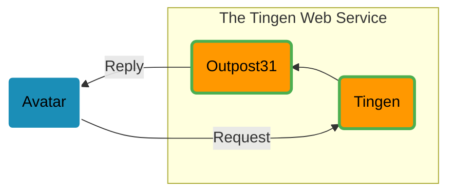

<!-- u250611 -->

  

  )

# The Tingen Web Service

[Netsmart's Avatar™](https://www.ntst.com/Solutions-and-Services/Offerings/myAvatar) is a behavioral health EHR that offers a recovery-focused suite of solutions that leverage real-time analytics and clinical decision support to drive value-based care.

While Avatar™ is a robust platform, it isn't perfect. The good news is that you can extend myAvatar™ functionality via Netsmart's Avatar™ Web Services, and/or custom web services that are written by other Avatar™ users.

**Tingen** is one such custom web service which includes various tools and utilities for Avatar™ that aren't included in the official release, and provides a solid foundation for building additional functionality quickly and efficiently.

## Tingen features

* Several built-in tools and utilities that extend the functionality of Avatar™
* A solid foundation to build additional Avatar™ custom tools and utilities
* Extremely customizable
* Robust logging
* ...and [more](https://github.com/spectrum-health-systems/Tingen-Documentation/blob/main/Static/tngnsrvc-features.md)!

# Tingen development

The Tingen web service is actually two components:

		<table>
		<tr>
			<td>
				
			</td>
      <td>
				
			</td>
		</tr>
    <tr>
			<td align="center">
				The Tingen <b>front end</b>
			</td>
      <td align="center">
				The Tingen <b>back end</b>
			</td>
		</tr>
	</table>

And they work like this:

# Tingen releases

There are three types of Tingen releases:

## Development releases

> WARNING!  
> Development releases may be broken and not fully tested, and should not be used in production environments!

Tingen/Outpost31 **development** is done using both [Tingen-Development](https://github.com/spectrum-health-systems/Tingen-Development) and [Outpost31](https://github.com/spectrum-health-systems/Outpost31).

		<table>
		<tr>
			<td>
				
        
			</td>
		</tr>
	</table>

## Stable releases

> WARNING!  
> Stable releases are not intended for production environments outside of Spectrum Health Systems. Use at your own risk!

Once the development version of Tingen has been tested and verified to be **stable**, Tingen and Outpost31 are compiled into [Tingen](https://github.com/spectrum-health-systems/Tingen).

	<table>
		<tr>
			<td>
				
			</td>
		</tr>
	</table>

## Community releases

Once a stable release has been in production at Spectrum Health Systems for a few months, it is released as the Tingen **Community Release**.

	<table>
		<tr>
			<td>
				
			</td>
		</tr>
	</table>

# Tingen documentation

There's a *ton* of documentation for Tingen.

You should probably start here:

	<table>
		<tr>
			<td>
				
			</td>
		</tr>
	</table>

## Other documentation

There are also:

* [Changelogs](https://github.com/spectrum-health-systems/Tingen-Documentation/blob/main/Changelogs/CHANGELOGS.md)
* [Roadmaps](https://github.com/spectrum-health-systems/Tingen-Documentation/blob/main/Roadmaps/ROADMAPS.md)

There are three two types of branches in this repository:

* **[main](https://github.com/spectrum-health-systems/Tingen/tree/main)**  
  This is the latest stable release of Tingen. You can think of this as the Release Candidate for the Tingen [Community Release](https://github.com/spectrum-health-systems/Tingen-CommunityRelease).

* **Tingen archive snapshots**  
  When development starts on a new monthly version, the previous version is archived to a separate branch (e.g., `24.9.0-stable`).

# Roadmaps and Changelogs

You can also review the Tingen [Roadmap](https://github.com/orgs/spectrum-health-systems/projects/51/views/3) and [Changelog](https://github.com/orgs/spectrum-health-systems/projects/51/views/4?groupedBy%5BcolumnId%5D=141162315&filterQuery=status%3ACompleted).

Remember, though, that the majority of the upcoming features/changes will be part of [Outpost31](https://github.com/spectrum-health-systems/Outpost31).
